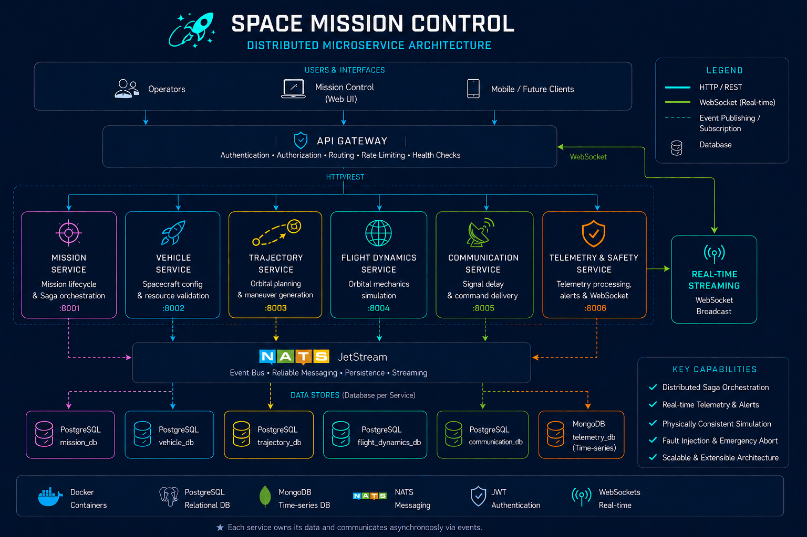

# 🚀 Space Mission Control

**A distributed microservice platform for planning, preparing, and simulating orbital space missions in the Earth–Moon system.**

[](https://www.python.org/)
[](https://fastapi.tiangolo.com/)
[](https://react.dev/)
[](https://nats.io/)
[](https://www.postgresql.org/)
[](https://www.mongodb.com/)
[](https://www.docker.com/)
[](./LICENSE)

---

## 🌌 Overview

The platform combines orbital mechanics, spacecraft resource management,
trajectory planning, distributed workflows and real-time telemetry into a
physically consistent simulation built around modern backend architecture.

The project is designed around a **physically consistent simulation model**, where every maneuver influences the spacecraft state according to simplified orbital physics rather than scripted behavior.

Originally developed as a **Bachelor's Thesis** at the **Faculty of Technical Sciences, University of Novi Sad**, the project is also intended to serve as a long-term portfolio project demonstrating modern backend architecture and distributed systems design.

---

## 🎯 Why this project

Space Mission Control explores how distributed software architecture can be
combined with orbital mechanics to model the complete lifecycle of a simulated
space mission.

Rather than aiming for aerospace-grade fidelity, the project focuses on clear
service boundaries, event-driven communication, distributed workflows,
real-time telemetry and deterministic physical simulation.

---

## 🎬 Demo

<p align="center">
  
</p>

<p align="center">
  Real-time LEO mission simulation with orbital propagation,
  telemetry streaming and mission safety monitoring.
</p>

---

## ✨ Features

- 🚀 End-to-end mission planning, preparation and execution
- 🛰️ Physics-based orbital flight simulation
- 📐 Trajectory planning and maneuver generation
- 🚀 Spacecraft and mission resource management
- 🔥 Distributed mission preparation with Saga orchestration
- 📡 Real-time telemetry and WebSocket streaming
- 🎛️ Interactive Mission Control dashboard
- 🛡️ Safety monitoring and anomaly detection
- 🚨 Distributed Emergency Abort workflow
- 📶 Communication delay and command delivery simulation
- 🔐 Authentication and centralized API Gateway
- 🗄️ Database-per-service persistence
- 🐳 Fully containerized local environment

---

## 🏗️ System Architecture

The platform is organized as a distributed microservice system.

| Service                    | Responsibility                                                                 |
| -------------------------- | ------------------------------------------------------------------------------ |
| API Gateway                | Authentication, authorization, routing, circuit breaking, health checks checks |
| Mission Service            | Mission lifecycle and Saga orchestration                                       |
| Vehicle Service            | Spacecraft configuration and resource validation                               |
| Trajectory Service         | Orbital planning and maneuver generation                                       |
| Flight Dynamics Service    | Orbital mechanics simulation                                                   |
| Communication Service      | Signal delay and command delivery                                              |
| Telemetry & Safety Service | Telemetry processing, alerts and WebSocket streaming                           |

<p align="center">
  
</p>

Services own their domain data independently and coordinate cross-service
operations asynchronously through NATS JetStream, while the API Gateway
provides the external HTTP and WebSocket boundary for the frontend.

---

## 🔄 Distributed Workflows

Mission preparation is coordinated through a Saga spanning the Vehicle,
Trajectory, Communication and Flight Dynamics domains. Failed preparation
steps trigger compensation of previously completed operations without relying
on distributed database transactions.

Emergency Abort follows the same event-driven philosophy: an abort request is
propagated through the platform, nominal simulation execution is stopped and
the mission lifecycle transitions through `ABORTING` to `ABORTED`.

---

## 🛠️ Technology Stack

### 🐍 Backend

- Python 3.13
- FastAPI
- SQLAlchemy
- Alembic
- Pydantic
- PyMongo

### ⚛️ Frontend

- React
- TypeScript
- Vite
- TanStack Query
- React Router

### 🗄️ Databases

- PostgreSQL
- MongoDB

### 🧪 Testing & Quality

- pytest
- mypy
- ruff
- pre-commit
- Oxlint

### 🧮 Scientific Computing

- NumPy
- SciPy

### 📡 Messaging

- NATS
- JetStream
- WebSockets

### 🐳 Infrastructure

- Docker
- Docker Compose

---

## 🌍 Physical Simulation

Space Mission Control uses a simplified but physically consistent orbital
mechanics model rather than scripted spacecraft movement.

The simulation includes:

- Newtonian gravity
- Orbital state vectors
- Spacecraft mass variation
- Propellant consumption
- Delta-v estimation
- Orbital maneuver execution
- Numerical integration (RK4 / `solve_ivp`)
- Circular orbit validation using real reference values

The current model focuses on **Low Earth Orbit (LEO)** and prioritizes
deterministic simulation and software-system integration over aerospace-grade
numerical fidelity.

---

## 📂 Repository Structure

```text
space-mission-control/
│
├── services/
│   ├── api-gateway/
│   ├── mission-service/
│   ├── vehicle-service/
│   ├── trajectory-service/
│   ├── flight-dynamics-service/
│   ├── communication-service/
│   └── telemetry-safety-service/
│
├── frontend/
├── contracts/
├── infrastructure/
├── docs/
├── scripts/
└── packages/
    ├── orbital-mechanics/
    └── messaging/
```

---

## 🚀 Getting Started

### Prerequisites

- Docker
- Docker Compose

### Clone the repository

```bash
git clone https://github.com/dmitar-strbac/space-mission-control.git
cd space-mission-control
```

### Configure environment

```bash
cp .env.example .env
```

On Windows PowerShell:

```powershell
Copy-Item .env.example .env
```

### Start the development environment

```bash
docker compose up --build
```

### Testing & Quality checks

Run the complete backend test suite from the repository root:

```powershell
.\scripts\test.ps1
```

Run repository-wide linting and static analysis:

```bash
uv run pre-commit run --all-files
```

Validate the frontend:

```bash
cd frontend
npm run lint
npm run build
```

### Local endpoints

| Component       | Address                 |
| --------------- | ----------------------- |
| Mission Control | `http://localhost:5173` |
| API Gateway     | `http://localhost:8000` |
| NATS Monitoring | `http://localhost:8222` |

---

## 🗺️ Roadmap

The complete Low Earth Orbit mission workflow is implemented, including
planning, distributed preparation, autonomous simulation, real-time Mission
Control and emergency handling.

### Current

- [x] Complete LEO mission lifecycle
- [x] Distributed microservice architecture
- [x] Real-time Mission Control
- [x] Safety and Emergency Abort workflows

### Planned Extensions

- [ ] LEO rendezvous and relative-motion simulation
- [ ] Three-dimensional orbital mechanics and plane changes
- [ ] Lunar transfer and lunar orbit missions

---

## 📄 License

This project is licensed under the **MIT License**. See the [LICENSE](LICENSE) file for details.

---

## 👨‍💻 Author

**[Dmitar Štrbac](https://github.com/dmitar-strbac)**

Bachelor's Thesis Project

Faculty of Technical Sciences

University of Novi Sad
